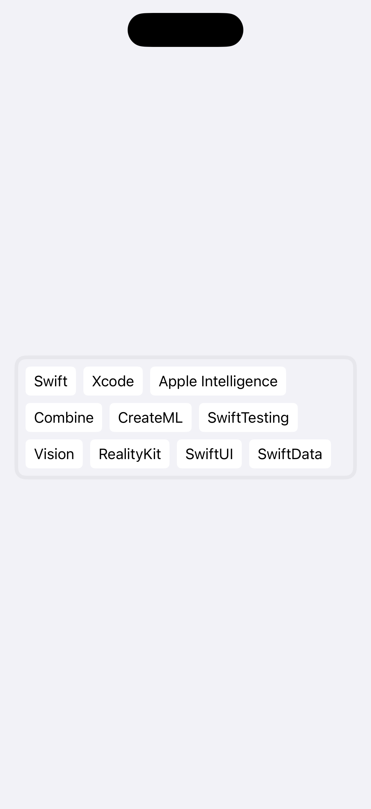

# Swiflow

[](LICENSE)
[](https://swift.org)
[](#)

A SwiftUI flow layout for wrapping views dynamically, designed to make it easy to layout chips, tags, or any dynamic set of items. **Swiflow** supports Swift 5.5 through 6.2 and provides a convenient API to integrate into your project.

## Features

- Wraps content automatically to new rows when space is insufficient.
- Customizable spacing between items.
- Compatible with SwiftUI's `ViewBuilder`.
- Supports dynamic content sizes using SwiftUI’s preference system.

<p align="center">
  
</p>

## Installation

### Swift Package Manager

1. In Xcode, select **File** > **Add Packages...**.
2. Enter the package repository URL (if hosting on GitHub or another remote).
3. Choose **Dependency Rule** and **Add Package** to your project.

Or update your `Package.swift` directly:

```swift
// swift-tools-version: 5.5
import PackageDescription

let package = Package(
    name: "YourProject",
    dependencies: [
        .package(url: "https://github.com/YourUser/Swiflow.git", .upToNextMajor(from: "1.0.0"))
    ],
    targets: [
        .target(name: "YourTarget",
                dependencies: [
                    .product(name: "Swiflow", package: "Swiflow")
                ]),
    ]
)
```
# Usage

### Step 1: Import the Library

```swift
import Swiflow
```
### Step 2: Prepare Your Data
Define an array of items you want to display:
```
let items = [
    "Swift", "Xcode", "Apple Intelligence", "Combine",
    "CreateML", "SwiftTesting", "Vision", "RealityKit",
    "SwiftUI", "SwiftData"
]
```
### Step 3: Use Swiflow in Your View
Use FlowItem or create your own custom view to display the items:
```
Swiflow(items) { item in
    FlowItem(text: item)
}
```

## License

This library is released under the MIT License. Feel free to use it in your own projects. Contributions are welcome!
